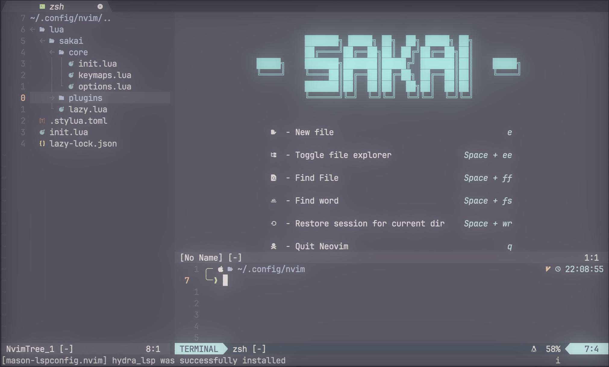

# Sakai Neovim

```
                                  ███████╗ █████╗ ██╗  ██╗ █████╗ ██╗          
                                  ██╔════╝██╔══██╗██║ ██╔╝██╔══██╗██║          
                        █████╗    ███████╗███████║█████╔╝ ███████║██║    █████╗
                        ╚════╝    ╚════██║██╔══██║██╔═██╗ ██╔══██║██║    ╚════╝
                                  ███████║██║  ██║██║  ██╗██║  ██║██║          
                                  ╚══════╝╚═╝  ╚═╝╚═╝  ╚═╝╚═╝  ╚═╝╚═╝        
```



***Sakai*** *(坂井)* is the name of my personal configuration for Neovim.
This is a light and functional configuration that converts Neovim to a full IDE with many easy-to-learn shortcuts.

This build is updated regularly.

## How to install?

```bash
cd ~
git clone https://github.com/2ELCN0168/sakai-nvim
mv sakai-nvim/nvim ~/.config
rm -rf sakai-nvim
```

## Dependencies

There are some dependencies:

- make ;
- gcc *(or any C compiler)* ;

  ***

  TODO :

  - [ ] - Add more icons ;
  - [ ] - Add themes ;
  - [ ] - Add terminal shortcuts inside Neovim ;
